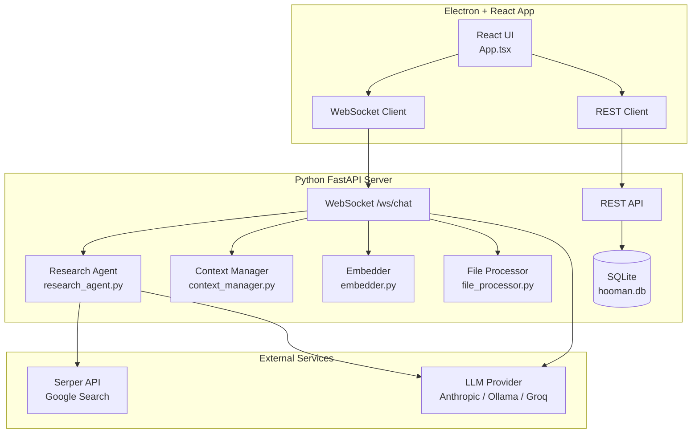
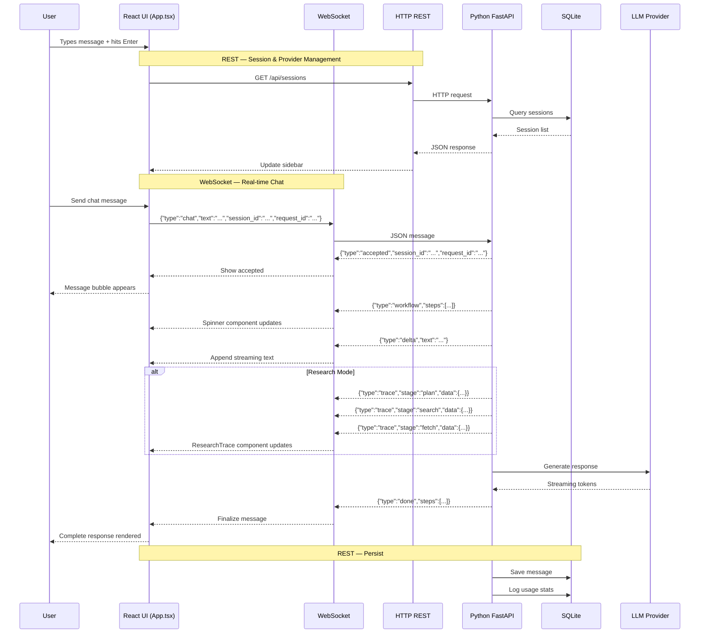
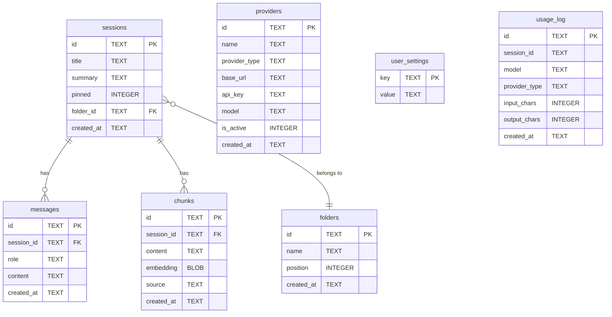
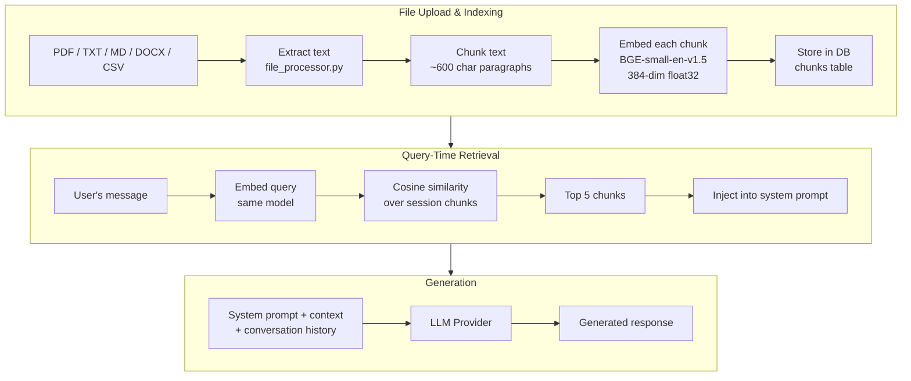
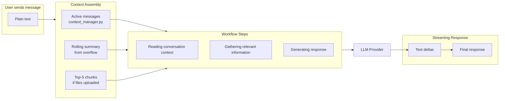
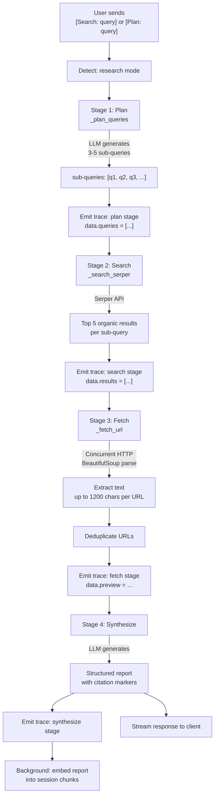
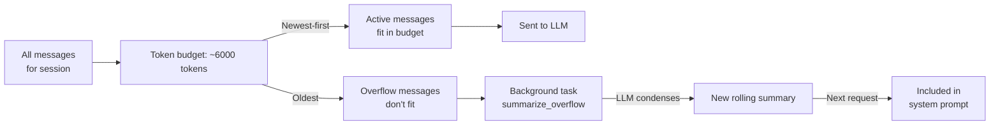
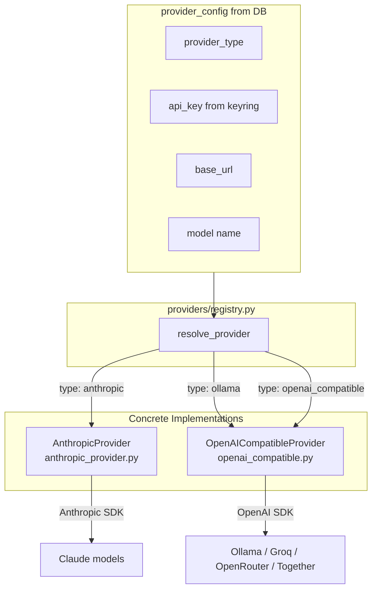

# Hooman

**Hooman** is a local-first desktop AI assistant with multi-model support, RAG, web research, and a clean chat interface — all running on your machine.


Research Agent Pipeline

1. Generate focused research subqueries using the selected LLM provider.
2. Search the web via Serper API.
3. Fetch and extract relevant page content.
4. Synthesize findings into a structured report with citations.
5. Persist conversation history and embed generated reports for future retrieval.



---

## Architecture Overview

Hooman is split into two main parts:

- **`backend/`** — Python FastAPI server handling all AI logic, database, file processing, and WebSocket streaming
- **`electron-app/`** — Electron desktop client with a React + Tailwind UI

```
D:\Code\Hooman\
├── backend/              # Python FastAPI server
│   ├── main.py           # Entry point, routes, WebSocket handler
│   ├── database.py       # SQLite schema + CRUD
│   ├── embedder.py       # Text embeddings (BGE-small-en-v1.5)
│   ├── file_processor.py # PDF/DOCX/TXT extraction + chunking
│   ├── research_agent.py # Plan → Search → Fetch → Synthesize
│   ├── context_manager.py# Token budget + rolling summarization
│   └── providers/        # LLM provider abstraction layer
│       ├── base.py
│       ├── anthropic_provider.py
│       ├── openai_compatible.py
│       └── registry.py
├── electron-app/         # Electron desktop client
│   └── src/
│       ├── main/         # Electron main process
│       ├── preload/      # Context bridge
│       └── renderer/     # React app
└── README.md
```

---

## How Frontend and Backend Connect

The frontend communicates with the backend through two channels:



### REST API

Used for **non-real-time** operations:

| Method | Endpoint | Purpose |
|--------|----------|---------|
| `GET` | `/api/sessions` | List all sessions |
| `POST` | `/api/sessions` | Create session |
| `PUT` | `/api/sessions/:id` | Rename |
| `DELETE` | `/api/sessions/:id` | Delete |
| `GET` | `/api/sessions/:id/messages` | Load messages |
| `PUT` | `/api/sessions/:id/pin` | Toggle pin |
| `POST` | `/api/sessions/:id/upload` | Upload file for RAG |
| `GET` | `/api/providers` | List LLM providers |
| `POST` | `/api/providers` | Add provider |
| `PUT` | `/api/providers/:id` | Edit provider |
| `DELETE` | `/api/providers/:id` | Remove provider |
| `GET` | `/api/folders` | List folders |
| `POST` | `/api/folders` | Create folder |
| `PUT` `/DELETE` | `/api/folders/:id` | Rename/delete |
| `GET` `/PUT` | `/api/settings/user` | User profile |
| `GET` | `/api/stats/usage` | Usage statistics |
| `GET` | `/health` | Health check |

### WebSocket (`ws://localhost:8000/ws/chat`)

Used for **real-time chat streaming**. Messages are JSON:

**Sent by client:**
```json
{"type":"chat","text":"Hello!","session_id":"uuid","request_id":"uuid","provider_id":"uuid","model":"claude-sonnet-4-6"}
{"type":"stop","request_id":"uuid"}
```

**Received by client:**
```json
{"type":"accepted","session_id":"...","request_id":"...","mode":"chat"}
{"type":"workflow","session_id":"...","request_id":"...","steps":[{"id":"...","text":"...","status":"running"}]}
{"type":"trace","stage":"plan","status":"completed","data":{"queries":["..."]}}
{"type":"delta","session_id":"...","request_id":"...","text":"Hello..."}
{"type":"done","session_id":"...","request_id":"...","steps":[...]}
{"type":"stopped","session_id":"...","request_id":"..."}
{"type":"error","session_id":"...","request_id":"...","message":"..."}
```

---

## Database

SQLite stored at `backend/hooman.db` with 6 tables:



API keys are stored securely in the OS keychain (Windows Credential Manager, macOS Keychain) via the `keyring` library — never in plaintext in the database.

---

## RAG Pipeline

Hooman implements **session-scoped RAG** — documents uploaded to a session are only retrievable from that session.



### File Processing (`file_processor.py`)

1. File upload → validates extension (`.pdf`, `.txt`, `.md`, `.docx`, `.csv`) and size (max 20 MB)
2. Text extraction:
   - **TXT/MD/CSV**: Direct UTF-8 decode
   - **PDF**: `pypdf.PdfReader`
   - **DOCX**: `python-docx`
3. Chunking: split on double newlines, merge paragraphs up to 600 chars, discard < 40 chars

### Embeddings (`embedder.py`)

- **Model**: `BAAI/bge-small-en-v1.5` (384-dimensional, ~130 MB download)
- **Library**: `fastembed` for efficient ONNX inference
- **Storage**: Raw `float32` numpy arrays serialized to bytes, stored as `BLOB` in SQLite
- **Similarity**: Brute-force cosine similarity across all chunks in the session
- **Top-K**: 5 chunks are injected as `Relevant context from this session:` in the system prompt

---

## Agent System

Hooman has 4 modes triggered by text prefixes:

| Prefix | Mode | What happens |
|--------|------|-------------|
| *(none)* | `chat` | Standard LLM chat with optional RAG context |
| `[Think: ...]` | `think` | Deep reasoning with tradeoff analysis |
| `[Search: ...]` | `research` | Web research agent (plan → search → fetch → synthesize) |
| `[Plan: ...]` | `research` | Same research agent, same pipeline |

The frontend provides three toggle buttons (Search, Think, Plan) that automatically wrap your text with the right prefix before sending.

### Chat Mode



1. Backend receives the message, detects `chat` mode (no prefix)
2. `context_manager.py` assembles the conversation:
   - Token budget of ~6000 tokens
   - Traverses messages newest-first, keeping what fits
   - Older messages become `overflow` for background summarization
3. RAG retrieval: embeds query, cosine similarity against session chunks, injects top-5
4. System prompt built with identity, context, and RAG results
5. LLM streams response via WebSocket deltas
6. After completion: overflow messages are summarized in the background and saved to `sessions.summary`

### Think Mode (`[Think: ...]`)

```mermaid
flowchart LR
    TXT["User sends<br/>[Think: ...]"] --> MODE[Detect: think mode]
    MODE --> STEPS[Workflow steps]
    STEPS --> P1[Parsing the problem]
    P1 --> P2[Reviewing conversation context]
    P2 --> P3[Weighting tradeoffs]
    P3 --> P4[Writing final answer]
    P4 --> RAG[Optional RAG context]
    RAG --> LLM[LLM generates<br/>deep reasoning]
    LLM --> OUT[Streaming response]
```



Same as chat mode but with a different system prompt that instructs the LLM to:
- Break down the problem step by step
- Consider multiple perspectives
- Weight tradeoffs explicitly
- Produce a thorough, well-reasoned answer

### Research Mode (`[Search: ...]` / `[Plan: ...]`)



The research agent (`research_agent.py`) follows a 4-stage pipeline:

**Stage 1 — Plan:**
- Calls the LLM to generate 3-5 specific sub-queries from the user's query
- Response must be a JSON array of strings
- Falls back to `[original_query]` if parsing fails

**Stage 2 — Search:**
- For each sub-query, calls [Serper API](https://serper.dev) (`google.serper.dev/search`)
- Returns top 5 organic results with title, URL, snippet
- All searches run concurrently via `asyncio.gather`

**Stage 3 — Fetch:**
- Concurrently fetches top URLs (up to 2 per sub-query, deduplicated)
- Uses `BeautifulSoup` to extract `<p>` text, stripping scripts/styles/nav/footer
- Truncates to 1200 characters per URL

**Stage 4 — Synthesize:**
- Builds a synthesis prompt with all fetched content
- LLM produces a structured report with inline citation markers like `[1]`, `[2]`
- Appends a References section listing sourced URLs
- Saves the report to the database
- Background task embeds the report into chunks for future RAG retrieval

---

## Context Management

Long conversations are handled by `context_manager.py`:



- **Token budget**: ~6000 tokens (~24,000 characters)
- **Algorithm**: traverse messages newest-first, keep what fits
- **Overflow**: older messages get summarized in the background by the LLM
- **Rolling summary**: stored in `sessions.summary`, included in system prompt on every request

---

## LLM Provider System

Multiple LLM providers are supported through an abstraction layer:



The default seeded providers are:

| Name | Type | Default Model |
|------|------|---------------|
| Claude | `anthropic` | `claude-sonnet-4-6` |
| Ollama | `ollama` | `qwen3:14b` |
| Groq | `openai_compatible` | `llama-3.3-70b-versatile` |

---

## Frontend Structure

```
electron-app/src/renderer/src/
├── main.tsx                       # React entry point
├── App.tsx                        # Main app (1282 lines)
│   ├── ChatsView()                # Inline: chat history browser
│   └── ProvidersView()            # Inline: provider CRUD
├── assets/
│   ├── main.css                   # Tailwind v4 + theme variables
│   ├── fonts/Helvetica.ttf
│   └── images/logo.png
├── hooks/
│   ├── use-theme.tsx              # Dark/light theme provider
│   └── use-mobile.tsx             # Mobile breakpoint
├── lib/utils.ts                   # cn() utility
└── components/
    ├── app-sidebar.tsx            # Sidebar with nav + session list
    ├── model-selector.tsx         # Provider dropdown
    ├── spinner.tsx                # Thinking steps animation
    ├── research-trace.tsx         # Research workflow visualization
    ├── settings-view.tsx          # Settings page (profile, usage, guide)
    └── ui/
        ├── sidebar.tsx            # shadcn sidebar framework (773 lines)
        ├── ai-prompt-box.tsx      # Rich input box (962 lines)
        ├── dropdown-menu.tsx      # shadcn dropdown
        ├── tooltip.tsx, button.tsx, avatar.tsx, etc.
```

---

## Getting Started

### Prerequisites

- Python 3.10+
- Node.js 20+
- An LLM provider key (Anthropic, or Ollama running locally, or Groq/OpenRouter)

### Setup

**1. Backend**

```bash
cd backend
python -m venv .venv
.venv\Scripts\activate      # Windows
source .venv/bin/activate    # macOS/Linux

pip install -r requirements.txt
cp .env.example .env
# Edit .env with your API keys

python main.py
# Server starts at http://localhost:8000
```

**2. Frontend**

```bash
cd electron-app
npm install
npm run dev
# Electron window opens at localhost:5173
```

### Environment Variables (`backend/.env`)

```
PORT=8000
ACTIVE_PROVIDER=ollama
ANTHROPIC_API_KEY=sk-ant-...
ANTHROPIC_MODEL=claude-sonnet-4-6
GROQ_API_KEY=...
GROQ_MODEL=llama-3.3-70b-versatile
OLLAMA_BASE_URL=http://localhost:11434/v1
OLLAMA_MODEL=qwen3:14b
SERPER_API_KEY=...              # Required for research agent
```

### Build for Production

```bash
cd electron-app
npm run build
# Output in out/
```

---

## Tech Stack

| Layer | Technology |
|-------|-----------|
| Desktop Framework | Electron 35 |
| Frontend | React 19, TypeScript, Tailwind v4 |
| UI Components | shadcn/ui, Radix, Framer Motion, Lucide Icons |
| Server | Python 3, FastAPI, Uvicorn |
| Database | SQLite (WAL mode) |
| LLM Providers | Anthropic SDK, OpenAI SDK (Ollama/Groq/OpenRouter) |
| Embeddings | BAAI/bge-small-en-v1.5 via fastembed |
| Web Search | Serper API (Google Search) |
| File Processing | pypdf, python-docx, BeautifulSoup |
| API Key Storage | OS keyring (keyring library) |
| Build Tool | electron-vite, Vite |
